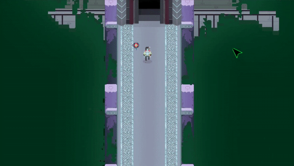
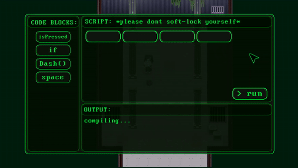
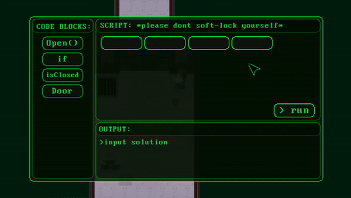
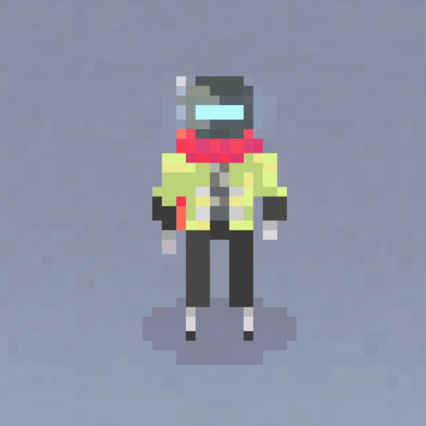
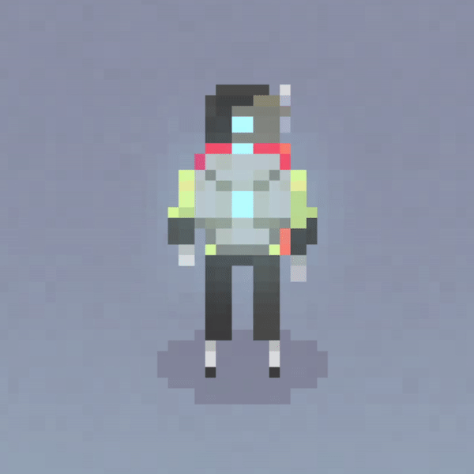
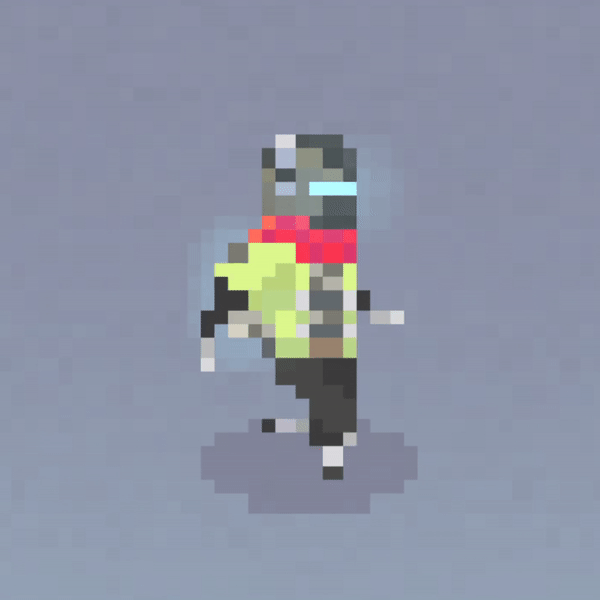
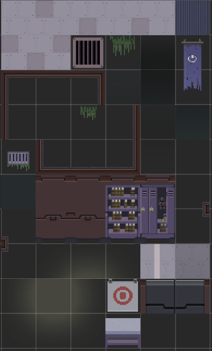
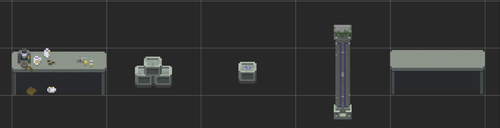
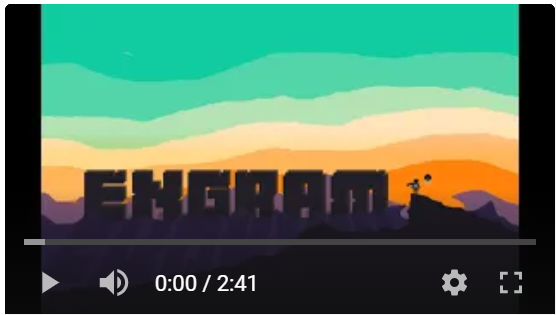

[![Contributors][contributors-shield]][contributors-url]
[![Forks][forks-shield]][forks-url]
[![Stargazers][stars-shield]][stars-url]
[![Issues][issues-shield]][issues-url]

<!-- PROJECT LOGO -->
 

  

  <h3 align="center">Engram</h3>

  

    Educational Programming RPG
     
    <a href="https://youtu.be/pl1nwN92yEk">View Demo</a>
    ·
    <a href="https://github.com/akozlev/engram/issues">Report Bug</a>
    ·
    <a href="https://github.com/akozlev/engram/issues">Request Feature</a>
  

<!-- TABLE OF CONTENTS -->
## Table of Contents

* [Achievements](#achievements)
* [About the Project](#about-the-project)
  * [Sudo Compiler](#sudo-compiler)
  * [Art](#art)
  * [Built With](#built-with)
* [Gameplay Demo](#gameplay-demo)
* [Team](#team)

<!-- Achievements -->
## Achievements

### Finalist at the [12th European Conference On Games Based Learning (ECGBL 2018)](https://www.academic-conferences.org/conferences/ecgbl/ecgbl-future-and-past/) 
**Hosted by:** SKEMA Business School, 
 
Sophia Antipolis, 
 
France

<!-- ABOUT THE PROJECT -->
## About The Project
 

 Engram = a hypothetical permanent change in the brain accounting for the existence of memory; a memory trace.

 

Engram is a puzzle role-play game (RPG) focused on teaching programming logic to 13-18-year olds. The player assumes the role of an Artificially Intelligent (AI) Robot who wakes to find that not only has its code been corrupted, causing the loss of many of its abilities, but that its spaceship is deserted and malfunctioning. The Robot, with the help of its companion Better Bot, must now escape the spaceship to the outside world, through interesting puzzles, treacherous platforming and quirky dialogue. The player will be presented with a new obstacle as they travel around the spaceship and enter new rooms, each with its own puzzle. The puzzle system is implemented as a pseudocode compiler which is opened via the terminals found on the level. The pseudocode compiler is in the style of block programming, inspired by those found in Scratch and Google’s Blockly.

 

  
  

 

Research shows that this was a more intuitive, simpler way of introducing programming to our target audience. The game concept is based on the idea that programming is used to solve problems; one identifies a problem or requirement in a system and then writes code to add or alter functionality in that system. We are not just teaching programming logic but how it can be applied to different, more complex problems. To achieve an interesting and rewarding overall learning experience different to traditional coding games, the input of the correct code solution can result in alteration of the game world, such as opening a door, stopping a saw, or even reprogramming an enemy turret. It can also allow the player/robot to acquire new abilities. The progression of both the player and the game’s AI robot are intrinsically linked. As the player learns programming, the character acquires new abilities to progress through this new environment they must both discover. Better Bot, the robot’s companion and the player’s help tool, is a way of setting the scene as well as introducing basic controls and mechanics. Better Bot also helps the confused protagonist through the puzzles with hints and suggestions throughout the game.

### Sudo Compiler

The puzzle system is based on a mock-compiler which assess whether the user inputted the correct solution. We started off creating a canvas and a panel within it to allow the compiler to be activated using script when triggered by the box collider. then we created cell sockets and movable code pieces, which allowed us to have the visual aspect of our compiler complete, all that was left was to add a “run” button which is an attribute of the compiler class and test the player’s inserted code against our own predefined functions.

  
  

### Art

The sprite animation/sprite sheets were all created within photoshop.

 

  
  
  
     
  
  
   
  
  

### Built With

* [Unity](https://unity.com/)
* [Photoshop](https://www.photoshop.com)
* [c#](https://docs.microsoft.com/en-us/dotnet/csharp/)

<!--Gameplay Demo-->
## Gameplay Demo

<!-- Team -->
## Team

### Angel Kozlev:

[![LinkedIn][linkedin-shield]][linkedin-url-a]
·
[angelkozlev@gmail.com](mailto:angelkozlev@gmail.com)

### Michael Cruz Cervera:

[![LinkedIn][linkedin-shield]][linkedin-url-m]
·
[michaelcruz1998@hotmail.com](mailto:michaelcruz1998@hotmail.com)

<!-- MARKDOWN LINKS & IMAGES -->
<!-- https://www.markdownguide.org/basic-syntax/#reference-style-links -->
[contributors-url]: https://github.com/michaelcruzcervera/engram/graphs/contributors
[contributors-shield]: https://img.shields.io/github/contributors/michaelcruzcervera/Best-README-Template.svg?style=flat-square
[forks-url]: https://github.com/michaelcruzcervera/engram/network/members
[forks-shield]: https://img.shields.io/github/forks/michaelcruzcervera/Best-README-Template.svg?style=flat-square
[forks-url]: https://github.com/michaelcruzcervera/engram/network/members
[stars-shield]: https://img.shields.io/github/stars/michaelcruzcervera/Best-README-Template.svg?style=flat-square
[stars-url]: https://github.com/michaelcruzcervera/engram/stargazers
[issues-shield]: https://img.shields.io/github/issues/michaelcruzcervera/Best-README-Template.svg?style=flat-square
[issues-url]: https://github.com/michaelcruzcervera/engram/issues
[linkedin-shield]: https://img.shields.io/badge/-LinkedIn-black.svg?style=flat-square&logo=linkedin&colorB=555
[linkedin-url-m]: https://www.linkedin.com/in/michael-cruz-cervera/
[linkedin-url-a]: https://www.linkedin.com/in/angelkozlev/
